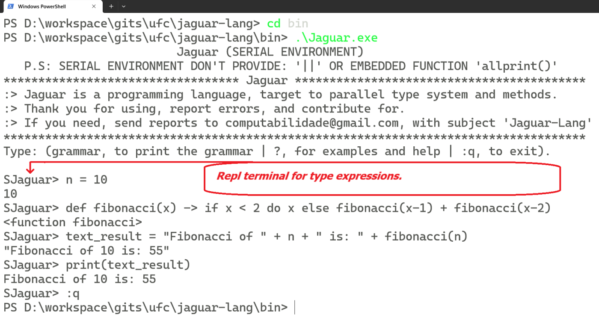
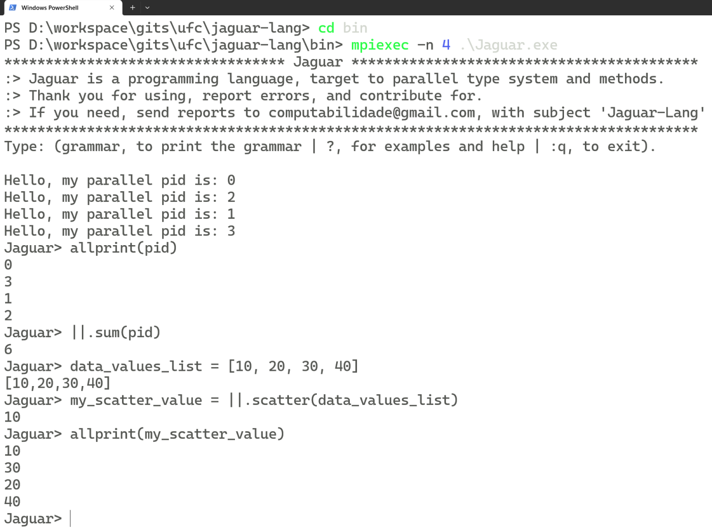

# 🚀 About and History 
### This repository include a parallel version of **UFC-Lang** Project (programming language project). 
### The parallel version is named "Jaguar".
### **Jaguar** is a project of general-purpose language, where the resources aims to:
1. #### Parallel programming;
2. #### Teory of graphs suport;
3. #### Expressive syntactic.
## Around this issue, we are looking for:
1. #### Otmizations;
2. #### Best machine codes;
3. #### Good practices of programming.
## Jaguar version is building by project members. It's a institucional research project, started in [ufc cadproj](https://cadproj.ufc.br/projects/592), but all people can contributed (become a member). For that, use the email informed in end of page.
# 📃 Features
## The **main** Jaguar **features** (target) are:
- ### Multi-paradigm: functional, imperative, concurrent, parallel and distributed, process-oriented;
- ### Typing discipline: dynamic, duck, weak typing;
- ### Component oriented (by compiled library).

# 🚀 Technical description and/or dependencies MPI:
## For Run Parallel Environment:
### 1. [MPI environment config on Windows](https://github.com/UFC-Jaguar/jaguar-lang/tree/main/cluster_environment_install/Windows);
### 2. [MONO/MPI environment config on Linux](https://github.com/UFC-Jaguar/jaguar-lang/tree/main/cluster_environment_install);
### 3. [Config a HPC Cluster on Linux](https://github.com/UFC-Jaguar/jaguar-lang/tree/main/cluster_environment_install/Linux)
### 4. A basic running schema on Linux:
#### 4.1 **NOTE: Running MPI local**:
<pre><code>sudo mkdir -p /opt/MPI</code></pre>
<pre><code>sudo chown $USER:$GROUPS /opt/MPI</code></pre>
<pre><code>cd /opt/MPI</code></pre>
<pre><code>git clone https://github.com/UFC-Jaguar/jaguar-lang</code></pre>
##### NOTE: Before run, you are need remember that [Mono/MPI](https://github.com/UFC-Jaguar/jaguar-lang/tree/main/cluster_environment_install) is used.
<pre><code>cd jaguar-lang/Base/</code></pre>
<pre><code>xbuild Jaguar.sln</code></pre>
<pre><code>cd bin/</code></pre>
<pre><code>mpiexec -n 4 mono ./Jaguar.exe</code></pre>
#### 4.2 **NOTE: Running a sample cluster, with "/opt/MPI"  folder common among master and workers**:
##### 4.2.1. Sample two nodes (n0, n1):
- Edit /etc/hosts, where n0 and n1 ipaddress should be defined. Sample:
<pre><code>127.0.0.1 localhost
10.0.2.6 n0
10.0.2.7 n1</code></pre>
- Insert the follow content on /opt/MPI/mpi_hosts:
<pre><code>n0:1
n1:1</code></pre>
<pre><code>cd /opt/MPI</code></pre>
<pre><code>git clone https://github.com/UFC-Jaguar/jaguar-lang</code></pre>
<pre><code>cd jaguar-lang/Base/</code></pre>
<pre><code>xbuild Jaguar.sln</code></pre>
<pre><code>cd bin/</code></pre>
<pre><code>mpiexec -n 4 -f /opt/MPI/mpi_hosts mono ./Jaguar.exe</code></pre>
## Basic scheme:

  

## Serial interative Repl example:

  

## Parallell interative Repl example:

  

# 🗨️ Contact by Email:
## computabilidade@gmail.com. Subject "Jaguar-Lang".

