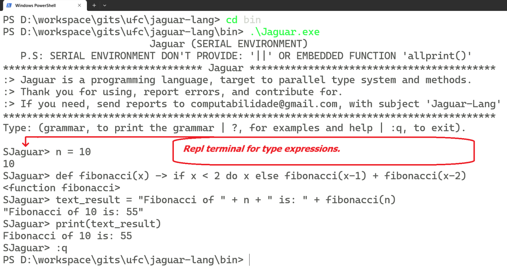

# 🚀 About and History 
### This repository include a parallel version of **UFC-Lang** Project (programming language project). 
### The parallel version is named "Jaguar".
### **Jaguar** is a project of general-purpose language, where the resources aims to:
1. #### Parallel programming;
2. #### Teory of graphs suport;
3. #### Expressive syntactic.
## Around this issue, we are looking for:
1. #### Otmizations;
2. #### Best machine codes;
3. #### Good practices of programming.
## Jaguar version is building by project members, because it's a institucional research project, started in [ufc cadproj](https://cadproj.ufc.br/projects/592). But all people can contributed. For that, use the email informed here (end line page).
# 📃 Features
## The **main features** target of jaguar are:
- ### Multi-paradigm: functional, imperative, concurrent, parallel and distributed, process-oriented;
- ### Typing discipline: dynamic, duck, weak typing;
- ### Component oriented (by compiled library).

# 🚀 Técnico e/ou Dependências:
## A base do projeto **Jaguar** fica em:
1. #### [Base CSharp](https://github.com/UFC-Jaguar/jaguar-lang/tree/main/Base);
2. #### [Configuração de ambiente MONO/MPI em Linux](https://github.com/UFC-Jaguar/jaguar-lang/tree/main/cluster_environment_install);
3. #### [Configuração de ambiente Windows MPI](https://github.com/UFC-Jaguar/jaguar-lang/blob/main/cluster_environment_install/Windows/Instrucoes.txt);
4. #### [Configuração de um Cluster HPC Simulado](https://github.com/UFC-Jaguar/jaguar-lang/tree/main/cluster_environment_install/Linux)

## Basic scheme:

  

## Serial interative Repl example:

  

## Parallell interative Repl example:

  

# 🗨️ Contact by Email:
## computabilidade@gmail.com. Subject "Jaguar-Lang".

